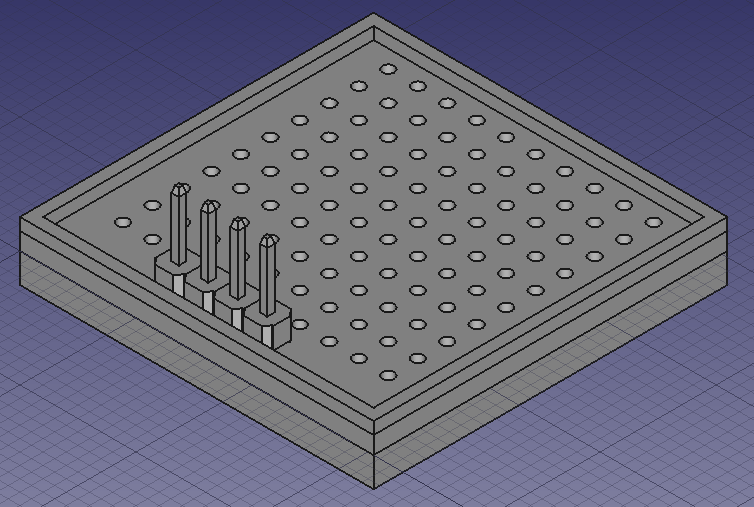

# PrintPCBs

Se trata de piezas imprimibles que permiten crear circuitos sencillos.

## [PrintPCB ProtoBoard](./PCBPProtoPrint/)

Primera versión de una PCB imprimible para hacer pruebas

[Diseño](./PCBPProtoPrint/PCBPrint_protoboard.fcstd)

Se pueden elegir el número de filas, columnas y de pines.
Basta con cambiar el número en la hoja de cálculo incluida en el diseño

## [PCBPrint LED (BC547)](PCBPProtoPrint/README.md)

Un diseño alternativo al Alhambra led para transistores de otro patillaje

## [PCBPrint LDR](PCBPrint_ldr/README.md)

Sensor luminoso analógico

## [PCBPrint Pulsador](PCBPrint_button/README.md)

Pulsador con conexión Pull Down

## Próximamente

* Led sin transistor (con 3 pines)
* Driver de motores (L293D)
* Detector de infrarrojos para mando a distancia
* LED RGB
* Siguelineas
  * Versión simple con los Led IR
  * Utilizando un opamp (LM358)
* Shield básico que permite conectar cables de 3 pines 

